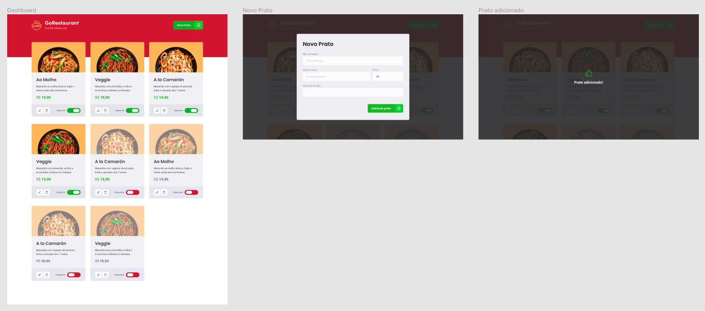

<h1 align="center">Desafio 10: GoRestaurant Web</h1>
<p align="center">
  
</p>


<p align="center">
  

  <a href="license.md">
  
  </a>
</p>

___

<h3 align="center">
  <a href="#information_source-sobre">Sobre</a>&nbsp;|&nbsp;
  <a href="#rocket-tecnologias-frameworks-dependencias">Tecnologias</a>&nbsp;|&nbsp;
  <a href="#licença">Licença</a>
</h3>

___

<br>

## :information_source: Sobre

<br>

Desenvolvimento da aplicação GoRestaurant, praticando o conceito de **CRUD** (Create, Read, Update, Delete).

Essa será uma aplicação que irá se conectar a uma fake API, e exibir os pratos de comida criados e permitir a criação, remoção e atualização desses pratos.

<br>

### :pushpin: Utilizando uma fake API

<br>

Para que se tenha os dados para exibir em tela, foi criado um arquivo que poderá ser utilizado como fake API para prover esses dados.

No `package.json` tem uma dependência chamada `json-server`, e um arquivo chamado `server.json` que contém os dados para uma rota `/foods`.
Comando para execução do servidor:

```bash
yarn json-server server.json -p 3333
```

<br>

### :pushpin: Layout da aplicação

<p align="center">
  
</p>

<br>

### 📌 Funcionalidades da aplicação

- **`Listar os pratos de comida da sua API`**: Sua página `Dashboard` deve ser capaz de exibir uma listagem, com o campo `title`, `value`, e  `description` e `available` de todos os pratos de comida que estão cadastrados na sua API.

**Dica**: Para exibir se o prato de comida está disponível ou não, você pode validar o campo `available` que é retornado da API e exibir `Disponível` caso seja true, e `Indisponível` caso seja false.

- **`Adicionar novos pratos de comida a sua API`**: Em sua página Dashboard você deve abrir um modal ao clicar no botão `Novo Prato` no Header. Esse modal deve ser responsável por cadastrar uma nova `food` passando os campos `image`, `name`, `description`, `value`.

**Dica 1**: O campo image deve ser uma URL, deixamos três URL de imagens como exemplo no arquivo server.json.

**Dica 2**: Ao enviar o request para sua API para salvar a `food`, lembre-se sempre de setar o campo `available` como true.

- **`Editar pratos de comida da sua API`**: Em sua página Dashboard você deve abrir um modal ao clicar no botão `Editar Prato`. Esse modal deve ser responsável por editar uma `food` passando os campos `image`, `name`, `description`, `value`.

**Dica**: Ao editar um item, quando for envia-lo para o backend, lembre de copiar os dados anteriores como o `available` e o `id`, ou eles serão  perdidos do seu arquivo server.json.

- **`Remover pratos de comida da sua API`**: Em sua página Dashboard você deve remover um prato de comida ao clicar no botão com ícone de lixeira no componente Food.

**Dica**: Após remover o item da sua API, lembre-se de remover ele também da listagem.

- **`Alterar disponibilidade dos pratos de comida da sua API`**: Em sua página Dashboard você deve alterar a disponibilidade de um prato de comida ao clicar no switch que é controlado pelo valor de `available`.


### :pushpin: Específicação dos testes

Para esse desafio, temos os seguintes testes:

* **`should be able to list all the food plates from your api`**: Para que esse teste passe, sua aplicação deve permitir que sejam listados, toda os pratos de comidas que são retornadas da sua fake API.

- **`should be able to add a new food plate`**: Para que esse teste passe, você deve permitir que um prato de comida seja adicionado a sua api, adicionando-o também à listagem.

- **`should be able to edit a food plate`**: Para que esse teste passe, você deve permitir que um prato de comida seja editado na sua api, editando-o também na listagem.

- **`should be able to remove a food plate`**: Para que esse teste passe, você deve permitir que um prato de comida seja removido da sua api, removendo-o também da listagem.

- **`should be able to update the availibility of a food plate`**: Para que esse teste passe, em sua dashboard você deve permitir que o status do prato de comida seja alterado entre `Disponível` e `Indisponível`;

<br>

## :rocket: Tecnologias, Frameworks e Dependências

- [ReactJs](https://pt-br.reactjs.org/)
- [TypeScript](https://www.typescriptlang.org/)
- [React-router-dom](https://www.npmjs.com/package/react-router-dom)
- [Styled-components](https://styled-components.com/)
- [Unform](https://www.npmjs.com/package/@rocketseat/unform)
- [Yup](https://www.npmjs.com/package/yup)
- [Axios](https://github.com/axios/axios)
- [Json-server](https://www.npmjs.com/package/json-server)

<br>

## Licença

Esse projeto está sob a licença MIT. Veja o arquivo [LICENSE](LICENSE) para mais detalhes.
